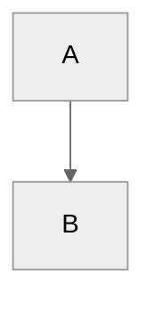

# Docs Authoring Guide

This directory is the local Hugo site root for the Genestack documentation.
The shared documentation source lives under `/docs/content`.

When editing documentation for this repository, treat the content tree as the
source of truth:

- `/docs/content` holds shared Markdown content and shared assets
- `/docs` holds the local Hugo renderer, theme wiring, build tooling, and
  local-only mechanics

The intent is to keep documentation content portable and content-first while
letting Hugo own rendering and navigation behavior.

## Editing Markdown

Write page content in Markdown with YAML front matter.

For ordinary pages, keep the source simple:

- put the page title in front matter
- avoid a duplicate level-1 heading in the body
- prefer semantic Markdown over raw HTML
- use filesystem layout plus front matter to express structure and order
- keep presentational decisions in the Hugo layer when possible

Typical front matter fields:

```yaml
---
title: "Page Title"
weight: 10
description: "Short summary for listings and page context."
---
```

Section pages use `_index.md`. Those files define the section title,
description, and ordering for a directory in the docs tree.

### Callouts

Use GitHub-flavored Markdown callouts.

Example:

```md
> [!NOTE]
> Body text
```

Do not use MkDocs admonitions such as:

```md
!!! note
    Body text
```

Custom titles are supported:

```md
> [!INFO] To Do:
> Body text
```

The local renderer also supports the custom `GENESTACK` type for
Genestack-specific implementation notes:

```md
> [!GENESTACK]
> This behavior is specific to Genestack.
```

Use the `GENESTACK` type only when the notice is specifically about:

- an opinionated Genestack implementation choice
- an assumption encoded by Genestack
- a Genestack-specific operational or deployment convention

Do not convert ordinary notes, warnings, or tips to `GENESTACK` unless the
content is actually Genestack-specific.

### Mermaid

Mermaid diagrams must use fenced blocks with Mermaid frontmatter config:

````md

````

Do not use Mermaid init directives such as:

```md
%%{init: ...}%%
```

### Links and Assets

Prefer repository-local relative links between docs pages and shared assets.

Shared documentation assets live under:

- `/docs/content/assets`

The local Hugo site mounts those shared assets into the published site under:

- `/assets/...`

## Linting and Local Validation

Markdown linting for shared docs content is driven by:

- `/docs/.markdownlint-cli2.jsonc`

That file is the source of truth for markdownlint behavior in this repo.
Do not assume stock markdownlint defaults if the config says otherwise.

The current configuration enables markdownlint defaults and then disables a
large set of style rules that are too restrictive for this docs corpus,
including many heading, spacing, HTML, and fenced-block rules. In practice,
that means:

- lint before making style-only edits based on assumptions
- prefer repo conventions over generic markdownlint advice
- keep Markdown clean, but do not rewrite content just to satisfy rules that
  are explicitly disabled

Run the docs-local validation commands from `/docs`:

```sh
make deps
make lint
make build
```

Useful local targets:

- `make deps`
  Downloads Node dependencies and Hugo modules.
- `make lint`
  Runs markdownlint against `/docs/content/**/*.md`.
- `make build`
  Builds the site and writes `/build.txt` at the end of the build.
- `make serve`
  Runs a local Hugo development server.
- `make setup`
  Installs local Playwright CLI browser tooling for docs verification.
- `make mrproper`
  Removes local generated artifacts and caches from `/docs`.

The build target writes:

- `/docs/public/build.txt`

This file is a post-build sentinel and can be polled to confirm that a rebuild
has completed before checking the site. That avoids checking stale output while
the build is still finishing.

## Navigation Model

Navigation is no longer defined by a central MkDocs nav block.

Navigation is now driven by a combination of:

- filesystem layout for hierarchy
- `_index.md` files for section identity
- front matter `weight` values for ordering

This means:

- moving a file or section changes its place in the docs tree
- section directories define sidebar groupings
- `_index.md` files define section titles and descriptions
- lower `weight` values appear earlier in a section

For section-based docs, this is the intended model:

- directories define structure
- `_index.md` defines section metadata
- leaf pages define their own title and weight

If you want to change sidebar placement now, the usual fix is one of:

- move the page to a different directory
- add or adjust an `_index.md`
- change the page or section `weight`

Do not look for a single central navigation manifest. That is no longer how
the docs tree is organized.

## Major Changes From MkDocs

This repository no longer uses MkDocs for local documentation rendering.

### Renderer and Tooling

The old local MkDocs stack was replaced with a Hugo site rooted at `/docs`
using Docsy-based local rendering and Hugo modules.

That means:

- MkDocs configuration no longer owns site behavior
- Hugo config, modules, layouts, and local tooling now live under `/docs`
- the shared content contract remains centered on `/docs/content`

### Syntax Changes

The migration away from MkDocs required several source-level syntax changes.

#### Admonitions

Old MkDocs syntax:

```md
!!! note
    Body text
```

Current syntax:

```md
> [!NOTE]
> Body text
```

#### Titled Admonitions

Old MkDocs syntax:

```md
!!! info "To Do"
    Body text
```

Current syntax:

```md
> [!INFO] To Do:
> Body text
```

#### Mermaid

Old MkDocs-era Mermaid blocks often used inline init directives.

Current syntax requires frontmatter inside the Mermaid fence:

````md

````

#### Navigation Ownership

Old MkDocs navigation was explicitly declared in `mkdocs.yml`.

Current navigation is content-owned:

- hierarchy comes from the filesystem
- section identity comes from `_index.md`
- order comes from `weight`

This is a structural change, not just a theme change.

## Authoring Intent

Markdown should carry document meaning, structure, and sequencing.
Hugo should carry rendering behavior.
The theme should carry presentation.

In practice, that means:

- keep Markdown semantic and renderer-neutral where possible
- avoid presentation-heavy HTML in shared content
- use front matter for metadata
- use directory structure for hierarchy
- let the local Hugo layer handle rendering behavior
