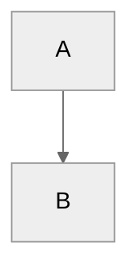

# Docs Style Guide

This file covers authoring conventions, Markdown syntax expectations, and the
Markdown linting policy for the Hugo docs tree.

Use [README.md](README.md) for build, test, and
PDF workflow instructions.

## Source Of Truth

Treat `/docs/content` as the shared content source of truth.

- `/docs/content` holds shared Markdown content and shared documentation assets
- `/docs` holds the Hugo renderer, theme wiring, build tooling, and local-only mechanics

The intent is to keep content portable and content-first while letting Hugo own
rendering behavior.

## Front Matter

Write page content in Markdown with YAML front matter.

Typical page fields:

```yaml
---
title: "Page Title"
weight: 10
description: "Short summary for listings and page context."
---
```

For ordinary pages:

- put the page title in front matter
- avoid a duplicate level-1 heading in the body
- prefer semantic Markdown over raw HTML where practical
- use filesystem layout plus front matter to express structure and order

Section pages use `_index.md`.
Those files define section title, description, ordering, and section identity.

The most important front matter fields in this docs tree are:

- `title`
- `weight`
- `description`

Other fields such as `type`, `cascade`, and `build` appear in some sections,
but `title`, `weight`, and `description` are the core authoring contract for
ordinary navigation and page presentation.

### `title`

`title` is the canonical page or section label for Hugo.

It is used for:

- the rendered page title
- section titles
- navigation labels
- list and landing-page labels

In MkDocs, the visible label often came from `mkdocs.yml`, while the page body
still began with a `#` heading.
In Hugo, the normal pattern is the opposite:

- define the title in front matter
- do not repeat the same title as a body H1 unless there is a deliberate reason

### `weight`

`weight` controls sibling ordering inside a section.

- lower values sort earlier
- pages without an appropriate weight can land in an unexpected order
- changing a weight is now one of the primary ways to change navigation order

In MkDocs, page order was usually controlled explicitly in `mkdocs.yml`.
In Hugo, order is local to each directory and is normally managed with
front-matter `weight`.

### `description`

`description` is used as section or page summary text.

It is commonly used for:

- section landing page summaries
- list-page context
- cards or page listings, depending on the template

Unlike `title`, `description` does not normally control navigation labels.
Its job is explanatory context, not ordering.

### `_index.md` Versus Ordinary Pages

Use `_index.md` for a section directory.

Use a normal Markdown filename such as `page.md` for a leaf page.

This distinction matters because `_index.md` defines the section itself.
That includes:

- section title
- section description
- section ordering within its parent
- section-wide defaults when `cascade` is used

Ordinary pages define only themselves.

## Callouts

Use GitHub-flavored Markdown callouts.

Correct form:

```md
> [!NOTE]
> Body text
```

Do not use MkDocs admonitions:

```md
!!! note
    Body text
```

Titled callouts are supported:

```md
> [!INFO] To Do:
> Body text
```

The local renderer also supports the custom `GENESTACK` callout type:

```md
> [!GENESTACK]
> This behavior is specific to Genestack.
```

Use `GENESTACK` only for Genestack-specific implementation or operational
conventions.

## Mermaid

Mermaid diagrams must use fenced blocks with Mermaid front matter config:

````md

````

Do not use inline Mermaid init directives such as:

```md
%%{init: ...}%%
```

## Character Set

Use ASCII in docs Markdown by default.

Avoid:

- emoji
- curly quotes
- en dashes and em dashes
- non-breaking spaces and hyphens

This is a rendering-consistency rule, not just a style preference.
The Hugo site and the Pandoc/LaTeX PDF pipeline do not handle all Unicode
characters equally well.

## Source Code Includes

Use fenced include blocks when you need to show tracked source files while
preserving syntax highlighting in both Hugo and Pandoc:

````md
```bash {include="scripts/example.sh"}
```
````

Optional slicing is supported:

````md
```bash {include="scripts/example.sh" start-line="10" end-line="24" dedent="2"}
```
````

These include paths are repo-root style, not page-relative.

Supported include roots are:

- `bin/...`
- `scripts/...`
- `base-helm-configs/...`
- `ansible/...`
- `recovery/...`
- `manifests/...`
- `etc/...`
- `.github/workflows/...`
- `docs/scripts/...`

## Links And Assets

Prefer repository-local relative links between docs pages and shared assets.

Shared documentation assets live under:

- `/docs/content/assets`

The local Hugo site mounts those shared assets into the published site under:

- `/assets/...`

## Differences From `mkdocs` Authoring

This repository no longer uses MkDocs for authoring or local rendering.
The change is not just a theme swap.
The content model is different.

### The Biggest Structural Changes

MkDocs used a central navigation manifest in `mkdocs.yml`.

That old model usually worked like this:

- page source files lived under `docs/`
- navigation hierarchy was declared explicitly in `mkdocs.yml`
- labels and nesting often came from the nav file rather than from the page files themselves

The Hugo model is different:

- shared page source files live under `docs/content/`
- directories define section hierarchy
- `_index.md` defines section identity
- front matter defines page metadata
- `weight` defines local ordering

There is no single replacement for `mkdocs.yml`.
Navigation is now distributed across the content tree itself.

### Navigation: `mkdocs.yml` Versus Directory Structure

In MkDocs, you could create or reorder navigation entirely by editing the nav
block in `mkdocs.yml` without moving files.

In Hugo, navigation comes from the content tree:

- parent directories create section groupings
- `_index.md` gives those sections a title and description
- leaf pages live inside those directories
- `weight` determines the order among siblings

So when you want to change where a page appears, the normal fixes are:

- move the page to a different directory
- add or edit the directory's `_index.md`
- adjust the page or section `weight`
- adjust the `title` in front matter if the label itself is wrong

Do not look for a single nav manifest to edit.

### Titles: Nav Label And Page Title Are Now The Same Source

In MkDocs, a page could have:

- one label in `mkdocs.yml`
- a different `#` heading in the page body

In Hugo, the normal source of truth is front matter:

- `title` provides the label for the page
- that same `title` is used wherever the theme needs the page name

That is why body H1 headings are unnecessary now.

### Ordering: `weight` Replaces Manual Nav Ordering

MkDocs nav ordering was explicit and global.

Hugo ordering is local and metadata-driven.

Within a given directory:

- lower `weight` values appear first
- higher `weight` values appear later
- if weights are missing or inconsistent, ordering may not match intent

This is one of the most important authoring differences from MkDocs.
If the page is in the correct section but the order is wrong, `weight` is
usually the field you need to change.

### Descriptions: Section And Listing Context Lives In Front Matter

MkDocs nav entries did not have the same front-matter-driven section summary
pattern used by this Hugo tree.

In Hugo:

- `description` on `_index.md` explains a section
- `description` on a leaf page provides short summary text for listings and context

This means more document metadata now lives with the content itself rather than
in a separate nav manifest.

### `_index.md` Replaces Several MkDocs Responsibilities

A section `_index.md` now carries responsibilities that used to be split
between filesystem placement and `mkdocs.yml`.

It can define:

- the section title
- the section description
- the section weight
- default metadata through `cascade`
- build behavior in special cases

If a directory is meant to be a real section in the docs tree, it usually
needs an `_index.md`.

### Example Mental Mapping

A rough MkDocs mental model:

```yaml
nav:
  - Overview:
      - Getting Started: genestack-getting-started.md
      - Components: genestack-components.md
```

Becomes a Hugo mental model closer to:

```text
content/
  overview/
    _index.md
    getting-started.md
    genestack-components.md
```

Where:

- `overview/_index.md` defines the section metadata
- each page defines its own `title`, `weight`, and optional `description`
- the directory itself expresses the hierarchy

### Markdown Syntax Differences From MkDocs

The authoring syntax also changed in several concrete ways.

#### Admonitions

MkDocs form:

```md
!!! note
    Body text
```

Hugo form used here:

```md
> [!NOTE]
> Body text
```

#### Titled Admonitions

MkDocs form:

```md
!!! info "To Do"
    Body text
```

Hugo form used here:

```md
> [!INFO] To Do:
> Body text
```

#### Mermaid

MkDocs-era content often used inline Mermaid init directives.

Old form:

```md
%%{init: ...}%%
graph TD
  A --> B
```

Current form:

````md

````

#### Page Titles

MkDocs pages commonly started with a literal H1 title in the body.

In this Hugo tree, the title normally belongs in front matter instead:

```yaml
---
title: "Page Title"
weight: 10
description: "Short summary."
---
```

And the body usually starts at `##` or with introductory prose instead of a
duplicate `# Page Title`.

#### Source Code Includes

MkDocs-era docs often used literal include syntax such as:

```md
--8<-- "bin/example.sh"
```

The Hugo/Pandoc shared form used here is a fenced include:

````md
```bash {include="bin/example.sh"}
```
````

## Authoring Intent

Markdown should carry document meaning, structure, and sequencing.
Hugo should carry rendering behavior.
The theme should carry presentation.

In practice:

- keep Markdown semantic and renderer-neutral where possible
- avoid presentation-heavy HTML in shared content unless there is a concrete need
- use front matter for metadata
- use directory structure for hierarchy
- let the Hugo layer handle rendering behavior

## Linting

Markdown linting is driven by
[.markdownlint-cli2.jsonc](.markdownlint-cli2.jsonc).

Run it from `/docs`:

```sh
make lint
```

The lint configuration starts from `default: true`, then disables a large set
of stylistic rules that are too restrictive for this docs corpus and for the
Hugo/Pandoc dual-renderer workflow.

That means two things are true at the same time:

- lint still matters
- stock markdownlint advice is not the source of truth in this repo

## Linting Philosophy

The current configuration is intentionally permissive about presentation and
formatting, but it still keeps the baseline markdownlint defaults for rules not
explicitly disabled.

In practice:

- do run lint before and after docs changes
- do not rewrite content just to satisfy generic markdownlint guidance that this repo has intentionally turned off
- do preserve readable, consistent Markdown even where the linter is permissive

## Disabled Lint Rules

The following rules are explicitly disabled in this repo:

- `MD001`
- `MD004`
- `MD007`
- `MD009`
- `MD010`
- `MD012`
- `MD013`
- `MD014`
- `MD018`
- `MD019`
- `MD022`
- `MD023`
- `MD024`
- `MD025`
- `MD026`
- `MD027`
- `MD028`
- `MD029`
- `MD031`
- `MD032`
- `MD033`
- `MD034`
- `MD036`
- `MD037`
- `MD040`
- `MD041`
- `MD046`
- `MD047`
- `MD049`
- `MD056`
- `MD058`
- `MD059`
- `MD060`

## What Those Disabled Rules Mean

### Heading Structure And Title Flexibility

The config does not enforce strict heading increment, first-line heading, or
single-H1 rules.

That is why rules such as these are disabled:

- `MD001`
- `MD024`
- `MD025`
- `MD041`

This matters because Hugo pages often derive their title from front matter
rather than from a literal `#` heading in the body.

### Spacing And Blank-Line Flexibility

The config does not strictly enforce blank lines around headings, lists,
fences, or blockquotes.

That includes rules such as:

- `MD012`
- `MD022`
- `MD031`
- `MD032`

This allows the docs tree to preserve existing formatting where the rendered
result is correct even if the source does not match stock markdownlint
preferences.

### List Style And Indentation Flexibility

The config does not strictly enforce unordered list marker style, list
indentation width, or ordered list marker style.

That includes:

- `MD004`
- `MD007`
- `MD029`

This is helpful because the current corpus contains a mix of historical list
styles that are rendered correctly and are not worth churn-only rewrites.

### Whitespace And Fence Flexibility

The config does not strictly enforce trailing spaces, tabs, fenced-code style,
or fenced-code language markers.

That includes:

- `MD009`
- `MD010`
- `MD040`
- `MD046`
- `MD047`

This is partly a compatibility concession for shared content that must survive
both Hugo and Pandoc processing.

### HTML, Link, And Inline-Markup Flexibility

The config allows inline HTML and does not enforce all of markdownlint's
opinions about bare URLs or emphasis-as-heading patterns.

That includes:

- `MD033`
- `MD034`
- `MD036`

This is necessary because the docs corpus still uses targeted HTML in some
places where Markdown alone is not expressive enough.

## What Lint Still Does

Anything not explicitly disabled still uses markdownlint's default behavior.

So even with the permissive configuration, lint can still catch real issues
such as:

- malformed Markdown structures covered by enabled defaults
- inconsistent constructs not covered by the disabled-rule list
- accidental regressions introduced while editing

The correct stance is:

- use lint as a guardrail
- use this style guide as the local contract
- do not use external markdownlint defaults as a reason to rewrite content that already conforms to this repo's policy
