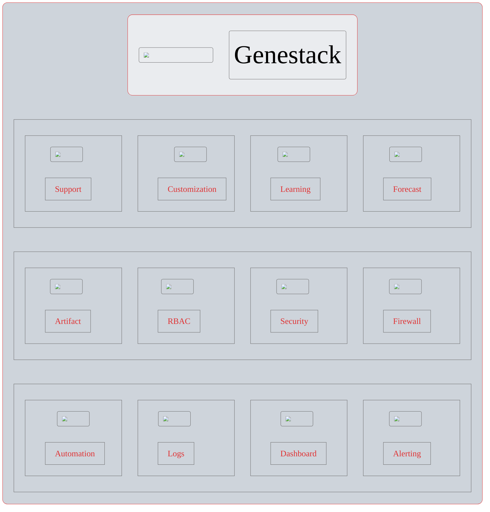

# Environment Architecture

Genestack is making use of some homegrown solutions, community operators, and OpenStack-Helm. Everything
in Genestack comes together to form cloud in a new and exciting way; all built with opensource solutions
to manage cloud infrastructure in the way you need it.

They say a picture is worth 1000 words, so here's a picture.

The idea behind Genestack is simple, build an Open Infrastructure system that unites Public and Private
clouds with a platform that is simple enough for the hobbyist yet capable of exceeding the needs of the
enterprise.
