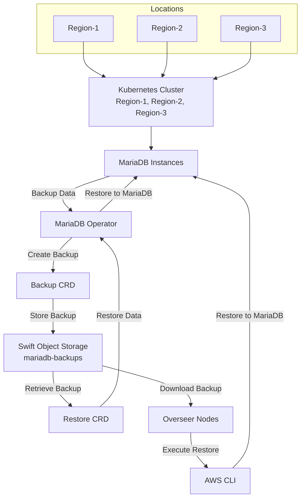

This document provides procedures to restore MariaDB backups stored in Swift
object storage with tempauth. It covers two methods:

- a Kubernetes `Restore` resource handled by the MariaDB Operator
- a manual restore path using the AWS CLI against Swift's S3-compatible API

These procedures assume the backups are stored in the `mariadb-backups`
container for the production regions `Region-1`, `Region-2`, and `Region-3`.

## Prerequisites

### Software

- `kubectl` installed and configured with access to the target production cluster
- AWS CLI installed on the overseer node

```bash
pip install awscli awscli-plugin-endpoint
```

### Credentials

- A Kubernetes secret such as `region-1-credentials`,
  `region-2-credentials`, or `region-3-credentials` containing
  `access-key-id` and `secret-access-key`, generated with:

```bash
openstack ec2 credentials create
```

- AWS CLI profiles such as `region-1_admin`, `region-2_admin`, and
  `region-3_admin` configured on the appropriate overseer nodes

> [!NOTE]
>
> OpenStack Swift exposes an S3-compatible API through the `s3api` middleware,
> so the standard AWS CLI can be used to interact with Swift object storage.
> Each profile in `~/.aws/credentials` and `~/.aws/config` stores the
> EC2-style access key, the secret key, and the region-specific Swift endpoint.

### Environment

- Access to the Kubernetes cluster and the overseer node for the target region
- Network access to the region-specific Swift endpoint
- A deployed MariaDB Operator with a `mariadb` resource in the cluster

## Backup and Restore Flow



## Restore Using Kubernetes `Restore` CRD

This method automates the restore process using the MariaDB Operator.

> [!NOTE]
>
> The `Restore` CRD is a Kubernetes custom resource that extends the API for
> restore operations. See the
> [Kubernetes custom resources documentation](https://kubernetes.io/docs/concepts/extend-kubernetes/api-extension/custom-resources/)
> for background.

### Backup and Restore of Specific Databases

Backups are created with the MariaDB `Backup` resource and, by default,
include all logical databases. To back up specific databases, use the
`databases` field when creating the backup.

By default, all databases in a backup are restored. To restore a single
database, specify the `database` field in the `Restore` resource:

```yaml
apiVersion: k8s.mariadb.com/v1alpha1
kind: Restore
metadata:
  name: restore
spec:
  mariaDbRef:
    name: mariadb
  backupRef:
    name: backup
  database: db1
```

### Procedure

#### Step 1: Configure the `Restore` resource

Create a file named `restore.yaml` with the following content, adjusting the
region-specific values:

```yaml
apiVersion: k8s.mariadb.com/v1alpha1
kind: Restore
metadata:
  name: maria-restore
  namespace: <namespace>
spec:
  mariaDbRef:
    name: mariadb
  s3:
    bucket: mariadb-backups
    prefix: cron
    endpoint: <region-endpoint>
    accessKeyIdSecretKeyRef:
      name: <region-credentials>
      key: access-key-id
    secretAccessKeySecretKeyRef:
      name: <region-credentials>
      key: secret-access-key
  database: <database_name>
```

Replace `<namespace>`, `<region-endpoint>`, `<region-credentials>`, and
`<database_name>` with values appropriate for your environment.

#### Step 2: Apply the restore

```bash
kubectl apply -f restore.yaml
```

#### Step 3: Monitor the restore

Check status:

```bash
kubectl describe restore maria-restore -n <namespace>
```

Monitor logs:

```bash
kubectl logs -f <operator-pod-name> -n <namespace>
```

Use `kubectl get pods` to identify the operator pod and wait for the restore
to reach `Succeeded`.

#### Step 4: Verify the restored data

```bash
kubectl exec -it <mariadb-pod-name> -n <namespace> -- mysql -u root -p
```

Run a query to confirm the restored data:

```sql
SELECT COUNT(*) FROM <table_name>;
```

> [!NOTE]
>
> Ensure the region-specific credentials secret exists before starting the
> restore:

```bash
kubectl get secret <region-credentials> -n <namespace> -o yaml
```

> [!TIP]
>
> For related operational background, also review the MariaDB operations guide
> in this documentation set.

## Manual Restore Using AWS S3 Commands

This method retrieves the backup from the overseer and restores it manually.
Use it as a fallback when the Kubernetes-native restore path is not suitable.

> [!WARNING]
>
> Before running these steps in production, test the process in a development
> or staging environment.

### Step 1: Access the region-specific overseer

```bash
ssh user@<region>-overseer-ip
```

### Step 2: Verify AWS CLI configuration

Config example:

```ini
[profile region-1_admin]
region = region-1
s3 =
  endpoint_url = https://swift.api.region-1.rackspacecloud.com
  signature_version = s3v4
```

Credentials example:

```ini
[region-1_admin]
aws_access_key_id = YOUR_ACCESS_KEY
aws_secret_access_key = YOUR_SECRET_KEY
```

Adjust the profile, region, and endpoint details for `Region-2` and `Region-3`.

Test the profile by listing available backups:

```bash
aws --profile <region>_admin s3 ls s3://mariadb-backups/
```

### Step 3: Retrieve the backup

List available backups:

```bash
aws --profile <region>_admin s3 ls s3://mariadb-backups/cron/
```

Download a specific backup:

```bash
aws --profile region-1_admin s3 cp \
  s3://mariadb-backups/cron/backup.2025-02-04T19:05:57Z.gzip.sql \
  /tmp/backup.2025-02-04T19:05:57Z.gzip.sql
```

> [!NOTE]
>
> Replace the filename with the backup you actually need to restore.

### Step 4: Restore the backup

```bash
mysql -u user -p < /tmp/backup.2025-02-04T19:05:57Z.gzip.sql
```

### Step 5: Single-database restore (optional)

If the backup contains multiple databases, extract the desired database
separately and restore it:

```bash
mysql -u user -p nova < nova_backup.sql
```

### Step 6: Verify

```bash
echo $?
mysql -u user -p -e "SELECT COUNT(*) FROM <table_name>;"
```

> [!NOTE]
>
> Ensure the overseer has network access to the region-specific Swift endpoint.

## References

- [MariaDB Operator Backup Documentation](https://github.com/mariadb-operator/mariadb-operator/blob/main/docs/BACKUP.md)
- [Rackspace Object Storage S3 CLI](https://docs.rackspacecloud.com/storage-object-store-s3-cli/)
- [MariaDB Backup and Restore Overview](https://mariadb.com/docs/server/server-usage/backup-and-restore/backup-and-restore-overview)

## Escalation

> [!WARNING]
>
> If validation fails, coordinate with the Admin Team or Database Team to
> resolve network or configuration issues. This escalation path may expand as
> the restore procedure evolves.
