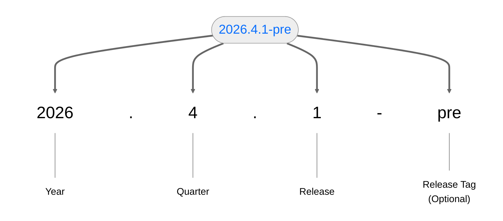
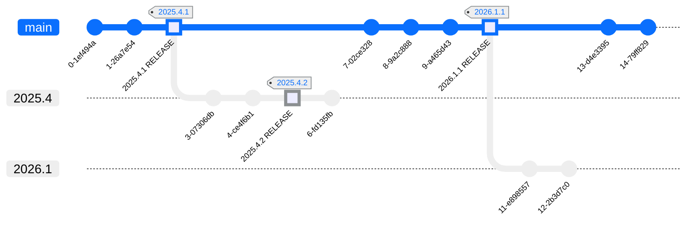

## Genestack Versioning

Genestack uses a variation of the [CalVer](https://calver.org/) versioning scheme for its releases.

Genestack will have branches for quarter a release is made.  Releases will be tags in that branch.

