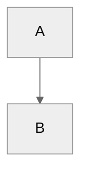

This page is the canonical authoring guide for the Genestack documentation
set. It covers both general documentation conventions and the site-specific
Markdown rules required by the Hugo website and the Pandoc PDF pipeline.

## Scope

The documentation source lives in the `/docs` subtree of the Genestack
repository. Content is rendered locally with Hugo and is also assembled into
PDF guides through Pandoc.

Because those renderers do not behave identically, some rules in this page are
not generic Markdown guidance. They are repository-specific requirements.

## Page Structure

Top-level headings using a single `#` should be avoided – these are automatically generated from the site structure.

Do not start pages with a main heading (i.e. `##`.) If necessary, use a small introductory paragraph before getting into structured headings.

### Page Hierarchy

Subsections should follow the natural heading hierarchy:

```markdown
## Main heading
### Subheading
#### Nested detail
```

Do not skip heading levels without a clear reason.  If there are typographical issues (font sizes, etc.) then _file a bug_.

## Markdown Basics

### Links

Use standard Markdown links:

```markdown
[Link text](path-or-url)
```

Use relative site paths for internal documentation links and full URLs for
external links.

### Inline Code

Inline code uses single backticks:

```markdown
`inline`
```

### Fenced Code Blocks

Code blocks use fenced backtick blocks:

````markdown
```yaml
key: value
```
````

## Source Code Includes

Fenced code blocks can include tracked repository files directly while
preserving syntax highlighting in both the website build and the PDF build.

Use repo-root-style include paths:

````markdown
```bash {include="bin/install-neutron.sh" start-line="1" end-line="12"}
```
````

Optional attributes:

- `start-line`
- `end-line`
- `dedent`

The `include` path is not relative to the current Markdown file. It is resolved
from the repository root across the approved subset below so the same Markdown
source works in both Hugo and Pandoc.

Supported include roots:

- `bin/...`
- `scripts/...`
- `base-helm-configs/...`
- `ansible/...`
- `recovery/...`
- `manifests/...`
- `etc/...`
- `.github/workflows/...`
- `docs/scripts/...`

If a file is outside those roots, it is not currently includable by the shared
renderer contract.

## Lists

### Bullets

Unordered lists use hyphen markers:

```markdown
- Item
  - Sub-item
```

### Numbering

Ordered lists should stay in one uninterrupted sequence:

```markdown
1. Item one
2. Item two
3. Item three
```

## Callouts

Callouts, sometimes also called admonitions or alerts, are used to highlight
important information.

Use GitHub-style callouts:

```markdown
> [!INFO]
>
> Body text
```

Do not use MkDocs-style admonitions:

```markdown
!!! warning
    Do not do these!
```

Titled callouts are supported:

```markdown
> [!INFO] To Do:
> Body text
```

The local renderer also supports the custom `GENESTACK` callout type for
Genestack-specific implementation notes.

## Mermaid

Mermaid diagrams must use fenced blocks with internal frontmatter config:

````markdown

````

Do not use Mermaid init directives such as:

```markdown
%%{init: ...}%%
```

## Character Set

Use ASCII in docs Markdown by default.

Do not use:

- emoji
- non-breaking hyphens or spaces
- typographic punctuation such as curly quotes or em dashes
- other non-ASCII glyphs unless there is a deliberate documented exception

This rule exists because the website renderer and the PDF pipeline do not
handle every Unicode character consistently. ASCII keeps the source portable
and avoids PDF font-substitution or missing-glyph warnings.

## Markdownlint

Run markdownlint before committing changes. The repository config lives in
[.markdownlint-cli2.jsonc](/Users/ken/Dev/genestack/docs/.markdownlint-cli2.jsonc).

You can run it directly from the `docs` directory:

```bash
npm exec markdownlint-cli2 "content/**/*.md"
```

Using the configured linter early is usually faster than fixing multiple
rendering problems after the fact.
