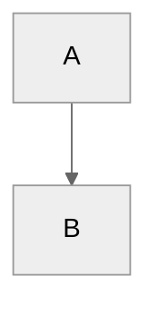

This page records Markdown rules that are specific to the Genestack docs
tooling and renderer setup, not generic Markdown behavior.

## Source Code Includes

Fenced code blocks can include tracked repository files directly while
preserving syntax highlighting in both the website build and the PDF build.

Use a repo-root-style include path:

````markdown
```bash {include="bin/install-neutron.sh" start-line="1" end-line="12"}
```
````

This will render as:

```bash {include="bin/install-neutron.sh" start-line="1" end-line="12"}
```

Optional attributes:

- `start-line`
- `end-line`
- `dedent`

The `include` path is not relative to the current Markdown file. It is resolved
from the repository root across the approved source subset below so the same
Markdown source works in both Hugo and Pandoc.

Supported include roots:

- `bin/...`
- `scripts/...`
- `base-helm-configs/...`
- `ansible/...`
- `recovery/...`
- `.github/workflows/...`
- `docs/scripts/...`

If a file is outside those roots, it is not currently includable by the shared
renderer contract.

## Callouts

Use GitHub-style callouts:

```markdown
> [!NOTE]
> Body text
```

Do not use MkDocs admonitions:

```markdown
!!! note
    Body text
```

Titled callouts are supported:

```markdown
> [!INFO] To Do:
> Body text
```

The local renderer also supports the custom `GENESTACK` admonition type for
Genestack-specific implementation notes.

## Mermaid

Mermaid diagrams must use fenced blocks with internal frontmatter config:

````markdown

````

Do not use Mermaid init directives such as:

```markdown
%%{init: ...}%%
```
